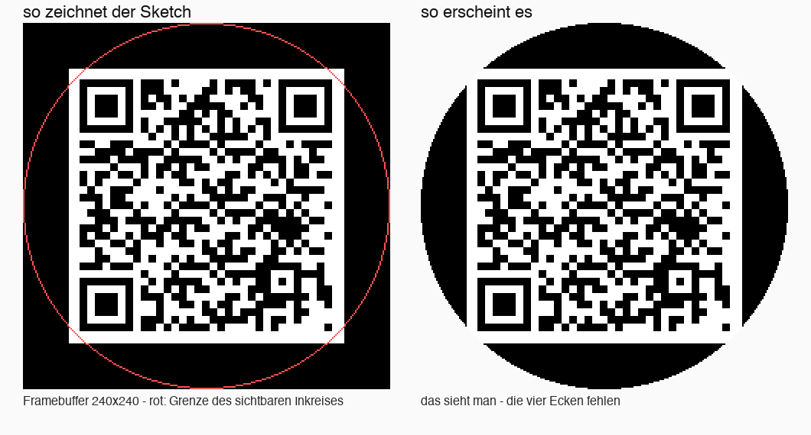

# ESP QR-Display

Ein kleines rundes Display, das auf Zuruf eine URL als QR-Code zeigt — gedacht
zum Abfotografieren mit dem Handy, ohne Tippen. Dazwischen zeigt es ein Logo.
Die URL kommt entweder per USB-Kabel oder über HTTP aus dem Netz.

| Ruhezustand | URL empfangen |
|---|---|
|  |  |

*Simulationen des Displayinhalts, gerendert aus den Maßen im Sketch — keine
Fotos.*

## Hardware

| | |
|---|---|
| **Board** | ESP32-2424S012 — Fertigmodul aus ESP32-C3 und rundem Display auf einer Platine |
| **MCU** | ESP32-C3 (RISC-V, WLAN 2,4 GHz, native USB) |
| **Display** | 1,28″ rund, **GC9A01**, 240 × 240 Pixel, SPI |
| **Besonderheit** | Das Panel ist ein **Inkreis**: der Frame ist 240 × 240, sichtbar ist nur der Kreis mit Radius 120. Die vier Ecken fehlen. |
| **Backlight** | GPIO 3, aktiv HIGH, im Sketch separat geschaltet (erst Bild zeichnen, dann einschalten — sonst blitzt der Bildaufbau) |
| **Stromversorgung** | über USB-C |

### Pinbelegung (steht so in `User_Setup.h`)

| Signal | GPIO |
|---|---|
| MOSI | 7 |
| SCLK | 6 |
| CS | 10 |
| DC | 2 |
| RST | −1 — nicht separat verdrahtet, liegt auf EN |
| Backlight | 3 |

SPI läuft mit 40 MHz Schreib- und 20 MHz Lesetakt.

## Aufbau des Projekts

```
ESP_QR_Display/
  ESP_QR_Display.ino     Arduino-Sketch (Display, QR, WLAN, HTTP, USB-Befehle)
  logo.h                 Logo als RGB565-Bitmap, 240x240
User_Setup.h             TFT_eSPI-Konfiguration -- muss in die Library kopiert werden
convert_logo.py          PNG/JPG -> logo.h
logo_preview.png         Vorschau des eingebauten Logos
mac-client/
  QR-Manager.applescript Menue-Client ueber USB (URL senden, WLAN einrichten)
  QR-Manager.scpt        dasselbe, kompiliert -- per Doppelklick startbar
  send_qr.applescript    aelterer Client, sendet per HTTP an eine feste IP
```

## Einrichten

**Arduino IDE 2.x**, Boardverwalter-URL für ESP32 hinzufügen:

```
https://raw.githubusercontent.com/espressif/arduino-esp32/gh-pages/package_esp32_index.json
```

Board: **ESP32C3 Dev Module**, und wichtig: **USB CDC On Boot: Enabled**. Ohne
das liegt `Serial` auf UART0, und die USB-Befehle unten funktionieren nicht.

Bibliotheken über den Bibliotheksverwalter:

- **TFT_eSPI** (Bodmer)
- **unoQRCode** — der Sketch bindet `unoqrcode.h` ein, nicht `qrcode.h`

`WiFi`, `WebServer`, `ESPmDNS` und `Preferences` bringt der ESP32-Kern mit.

### TFT_eSPI konfigurieren

TFT_eSPI liest seine Pinbelegung zur Compilezeit aus einer Header-Datei in der
Library selbst — nicht aus dem Sketch. Deshalb:

1. `User_Setup.h` aus diesem Projekt nach
   `~/Documents/Arduino/libraries/TFT_eSPI/User_Setup.h` kopieren.
2. In `User_Setup_Select.h` der Library sicherstellen, dass nur
   `#include <User_Setup.h>` aktiv ist.

Bleibt das Display schwarz, ist fast immer dieser Schritt vergessen worden.

## WLAN einrichten

**Die Zugangsdaten stehen absichtlich nicht im Quellcode.** Der Sketch legt sie
über `Preferences` im NVS ab (Namespace `wifi-store`) und nimmt sie bei Bedarf
per USB entgegen. Damit lässt sich der Sketch unverändert weitergeben und das
Gerät auch in einem fremden WLAN aufsetzen.

Bequem über den Menü-Client:

```
mac-client/QR-Manager.scpt   ->   "WLAN einrichten"
```

Oder direkt aufs serielle Gerät, Format `WLAN:SSID,Passwort`:

```bash
echo 'WLAN:MeinNetz,geheim' > /dev/cu.usbmodem101
```

Danach startet der ESP von selbst neu und verbindet sich. Den Port findet man
mit `ls /dev/cu.usbmodem*`.

Ein farbiger Punkt am unteren Rand zeigt den Stand: **gelb** verbindet,
**grün** verbunden, **rot** fehlgeschlagen. Er sitzt bei y = 235 und liegt damit
sehr weit außen — auf dem runden Panel ist er je nach Rahmen kaum zu sehen.

## URL anzeigen

**Per USB** — jede Zeile, die keine WLAN-Anweisung ist, wird als URL genommen:

```bash
echo 'https://example.com' > /dev/cu.usbmodem101
```

**Per HTTP**, sobald das Gerät im WLAN ist:

```bash
curl -X POST --data-urlencode 'url=https://example.com' http://esp-qr.local/qr
```

Der QR-Code bleibt **30 Sekunden** stehen (`QR_DURATION_MS`), danach kehrt das
Display zum Logo zurück.

### HTTP-API

| Methode | Pfad | Parameter | Wirkung |
|---|---|---|---|
| POST | `/qr` | `url=<URL>` (form-urlencoded) | QR für 30 s anzeigen |

Mehr gibt es nicht — kein GET, keine Weboberfläche, keine `/logo`-Route. Der
mDNS-Name ist `esp-qr` (also `http://esp-qr.local`), die IP steht nach dem Start
im seriellen Monitor bei 115200 Baud.

## Logo austauschen

```bash
pip3 install Pillow
python3 convert_logo.py mein_logo.png ESP_QR_Display/logo.h
```

Das Skript skaliert und zentriert auf 240 × 240 und schreibt eine RGB565-Bitmap.
Danach den Sketch neu flashen. Weil das Panel rund ist, lohnt es sich, das Logo
schon **rund maskiert** anzuliefern — alles außerhalb des Inkreises ist ohnehin
nicht sichtbar.

## Was intern passiert

1. Backlight aus, Display initialisieren, Logo zeichnen, Backlight an.
2. WLAN-Daten aus dem NVS lesen. Sind welche vorhanden: verbinden, maximal
   10 Sekunden warten, dann mDNS registrieren und den HTTP-Server auf Port 80
   starten.
3. `loop()` bedient parallel den Webserver und die serielle Schnittstelle.
4. Bei einer URL: schwarzer Grund, weiße Box 180 × 180 bei (30, 30), darin der
   QR-Code. Die QR-Version wird nach Länge gewählt — Version 4 bis 70 Zeichen,
   darüber Version 9. Sehr lange URLs (> ~200 Zeichen) passen nicht mehr.
5. Nach 30 Sekunden wieder das Logo.

### Warum die Maße so knapp sind



Der Sketch zeichnet in einen quadratischen Framebuffer, sichtbar ist aber nur
der Inkreis mit Radius 120. Nachgerechnet für Version 4 (33 Module, Skalierung
180 ÷ 33 = 5 px, also 165 × 165 px bei Offset 7):

| | Eckabstand zur Mitte | |
|---|---|---|
| weiße Box 180 × 180 bei (30,30) | 127,3 px | wird beschnitten |
| QR-Code 165 × 165 bei (37,37) | 117,4 px | passt, **2,6 px Reserve** |

Die Ecken der weißen Fläche fallen also weg — das ist gewollt und harmlos. Der
QR-Code selbst liegt mit knapp drei Pixeln Luft innerhalb des Kreises. **Wer die
Box vergrößert oder den Offset verändert, schneidet den Code an** und macht ihn
unlesbar. Die verbleibende Quiet-Zone beträgt 7 px, also 1,4 Module; die QR-Norm
empfiehlt 4. In der Praxis lesen Handys das zuverlässig, aber Luft nach unten ist
keine mehr.

## Wo dieses Repo lebt

Entwickelt wird zu Hause, **Gitea ist das Original**. GitHub ist ein
automatischer Push-Mirror und dient als öffentlicher Lesezugang:

```
Gitea   http://interne-adresse/work/esp-qr-display   <- hierhin pushen
GitHub  https://github.com/ooooli/esp-qr-display       <- Spiegel, folgt von selbst
```

**Nicht direkt nach GitHub pushen.** Der Mirror synchronisiert bei jedem Push
und überschreibt, was dort nicht aus Gitea kommt.

## Bekannte Einschränkungen

Ehrlich dokumentiert, statt später darüber zu stolpern:

- **Kein WLAN-Reconnect.** Verbunden wird nur einmal beim Start, mit 10 Sekunden
  Geduld. Bricht das WLAN später weg, versucht der Sketch von sich aus nichts —
  bis zum nächsten Neustart bleibt nur der USB-Weg. Für ein Gerät, das ohnehin
  meist am Kabel hängt, ist das verkraftbar; wer es dauerhaft im Netz braucht,
  müsste einen Reconnect mit Backoff nachrüsten.
- **„Zurück zum Logo" im QR-Manager wirkt nicht.** Das Script sendet `logo`, der
  Sketch kennt diesen Befehl aber nicht und macht daraus brav einen QR-Code mit
  dem Text „logo". Entweder im Sketch abfangen oder den Menüpunkt entfernen.
- **`send_qr.applescript` hat eine feste IP** (`esp-qr.local`), die im aktuellen
  Heimnetz einem anderen Gerät gehört. Wer den HTTP-Weg nutzen will, sollte dort
  `esp-qr.local` oder die richtige IP eintragen — oder gleich den USB-Client
  nehmen.
- **Farben invertiert?** In `User_Setup.h` `TFT_INVERSION_ON` einkommentieren.
- **`esp-qr.local` unerreichbar?** Manche Router blockieren mDNS. Dann die feste
  IP verwenden und im Router eine DHCP-Reservierung setzen.
